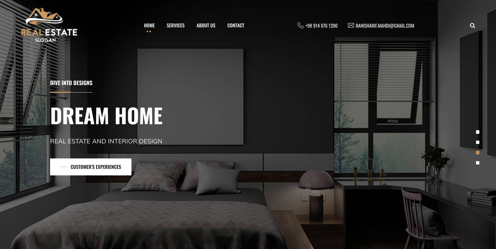
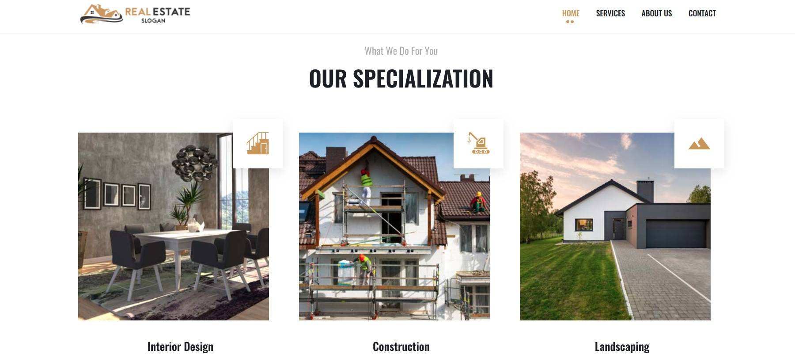

# DREAM HOME

Find your dream home via AI and 3D visualization.
To take a trivial example, which of us ever undertakes laborious physical exercise, except to obtain some advantage from it right to find fault with a man who chooses to enjoy a pleasure that has no annoying.

### Contributors

<table>
<tr>
    <td align="center" style="word-wrap: break-word; width: 150.0; height: 150.0">
        <a href=https://github.com/banisharifm>
            
             
            <b>Mahdi Banisharif</b>
        </a>
    </td>
    <td align="center" style="word-wrap: break-word; width: 150.0; height: 150.0">
        <a href=https://github.com/armanexplorer>
            
             
            <b>Arman Mazloumzadeh</b>
        </a>
    </td>
    <td align="center" style="word-wrap: break-word; width: 150.0; height: 150.0">
        <a href=https://github.com/MSharbaf>
            
             
            <b>Mohammadreza Sharbaf</b>
        </a>
    </td>
    <td align="center" style="word-wrap: break-word; width: 150.0; height: 150.0">
        <a href=https://github.com/bhzm>
            
             
            <b>Bahman Zamani</b>
        </a>
    </td>
</tr>
</table>
